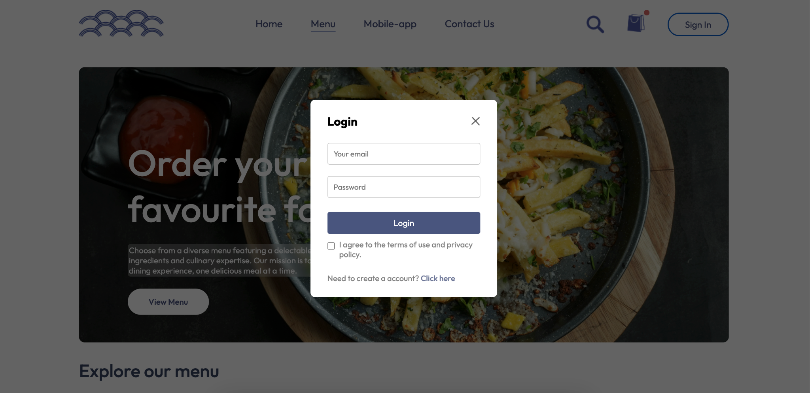
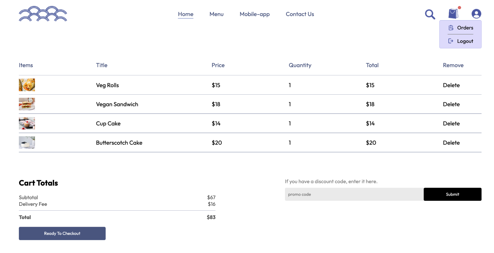
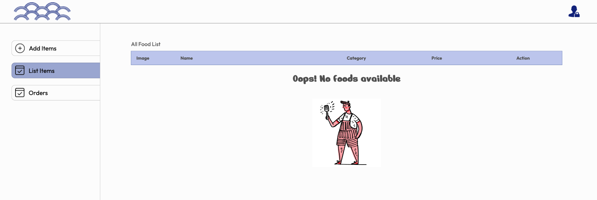
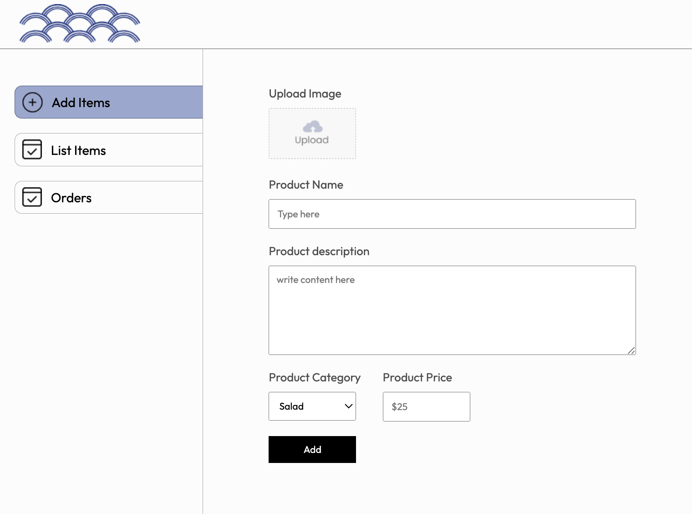

# Food Delivery Platform Documentation

## **Table of Contents**

1. Introduction

2. Features

3. Tech Stack

4. Installation

5. Usage

6. API Endpoints

7. Database Schema

8. Authentication

9. Stripe Integration

10. Admin Features

11. Future Enhancements

## **Introduction**

The **Food Delivery Platform** is a full-stack web application that allows users to browse, order food online, and manage their orders. This project is built using the **MERN** stack, leveraging MongoDB for data storage, Express for backend API handling, React for frontend user interfaces, and Node.js for server-side logic. Additionally, the platform integrates **Stripe** for payment processing.

## **Features**

- **User Authentication**: Secure sign-up, login, and JWT-based authentication.

- **Menu Management**: Browse and search for menu items, including categories and item details.

- **Order Management**: Users can add items to their cart, place orders, and track their orders in real time.

- **Admin Functionality**: Admins can add, update, delete menu items, and manage user orders.

- **Payment Integration**: Uses **Stripe** for secure payments.

- **Responsive Design**: The platform is optimized for both desktop and mobile devices.

## **Tech Stack**

- **Frontend**: React, Axios, HTML5, CSS3

- **Backend**: Node.js, Express.js

- **Database**: MongoDB with Mongoose ORM

- **Authentication**: JSON Web Tokens (JWT)

- **Payment**: Stripe API

## **Installation**

### **Prerequisites**

- Node.js (v14+)

- MongoDB

- Stripe Account

Set up environment variables:

- **.env** file in backend/

```
MONGO_URI=mongodb+srv://<username>:<password>@cluster0.mongodb.net/food_delivery
JWT_SECRET=your_jwt_secret
STRIPE_SECRET_KEY=your_stripe_key
```
Run the application:

```
# Start backend server
cd backend
npm run dev

# Start frontend server
cd frontend
npm start
```
## **Usage**

- **Frontend**: The user can browse the menu, add items to the cart, and place orders. After signing up or logging in, users can track their order status.

- **Backend**: The backend serves RESTful APIs to handle CRUD operations for menu items, orders, and users. It also handles authentication and integrates with Stripe for payment processing.









## **API Endpoints**

### **User**

- **POST** /api/users/register: Register a new user

- **POST** /api/users/login: User login

### **Menu**

- **GET** /api/menu: Get all menu items

- **POST** /api/menu: Add a new menu item (Admin only)

- **PUT** /api/menu/:id: Update menu item (Admin only)

- **DELETE** /api/menu/:id: Delete menu item (Admin only)

### **Orders**

- **POST** /api/orders: Place a new order

- **GET** /api/orders/user/:userId: Get all orders for a specific user

## **Database Schema**

### **Users**

```
{
  "_id": "ObjectId",
  "name": "String",
  "email": "String",
  "password": "String (hashed)",
  "isAdmin": "Boolean"
}
```
### **Menu Items**

```
{
  "_id": "ObjectId",
  "name": "String",
  "description": "String",
  "price": "Number",
  "category": "String",
  "imageUrl": "String"
}
```
### **Orders**

```
{
  "_id": "ObjectId",
  "user": "ObjectId (ref: users)",
  "items": [
    {
      "menuItem": "ObjectId (ref: menu)",
      "quantity": "Number"
    }
  ],
  "totalPrice": "Number",
  "status": "String"
}
```
## Authentication
- JWT tokens are used for user authentication.
`Tokens are generated upon login and sent with every protected route as part of the ``Authorization`` header.`


- Stripe Integration
`Stripe` is used for processing payments. `The payment flow is integrated into the order placement process. 
A Stripe secret key is required in the .env file.


## Admin Features
`Menu Management`: Admin users can add, update, or remove menu items.`

`Order Management`: Admins can view all orders and change their status (e.g., from "Pending" to "Delivered").`


## Future Enhancements

`Real-time Notifications`: Integrate WebSockets to notify users about order status updates in real-time.`

`Review System`: Allow users to leave reviews for menu items.`

`Multi-language Support`: Implement language localization for broader user reach.`

`AI-Based Recommendations`: Provide personalized menu recommendations based on user preferences.`


